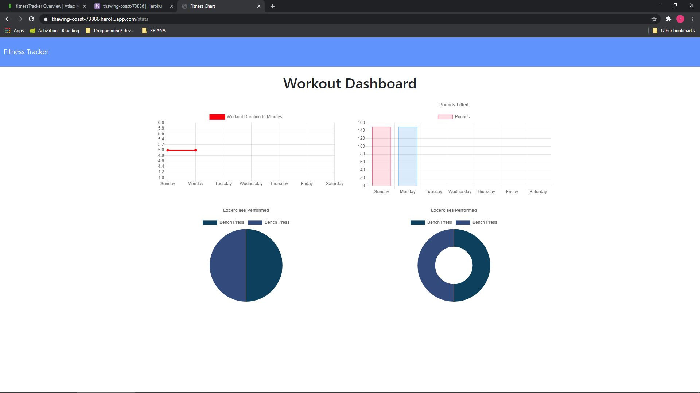
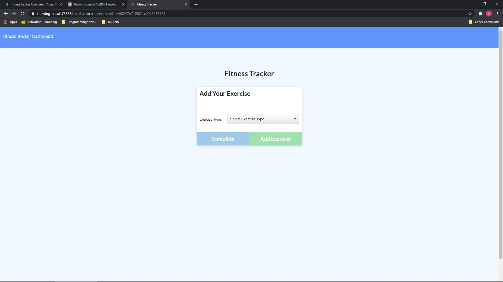

# Workout-Tracker
Click here to view deployment 
[Link](https://thawing-coast-73886.herokuapp.com/?id=602ebba5b31aed001549f420)

## *Objective* 
    To produce a program that stores persistant data to aid in a persons health and finess goals. 

### Method

using nodeJS  and various npms along with your standard html/css i created a web based application that uses a noSQL database to track exercise routines.

 

 

### Usage 
this web application can help you keep track of workout and exercise routines to aid in your fitness goals

### Instalation
To make the project work you will need -
* an editor or ide that will save file in the proper types *(html,css,javascript)*  
`Visual Studio or Visual Studio Code` will work great.
* using a version control system you can fork and clone my repo, you could also 
just download the files directly from git hub.
* make sure to have a terminal/console you can use like cmd or bash
* you need to have node.js installed

### How To

Click here to view deployment 
[Link](https://thawing-coast-73886.herokuapp.com/?id=602ebba5b31aed001549f420)

### screenshots / Code example
 
 

### Technology
* Node.js [Link](https://nodejs.org/en/)
* NPM- inquirer [Link](https://www.npmjs.com/package/inquirer)
* MongoDB [Link](https://www.mongodb.com/)

### Contributing
Pull requests are welcome. For major changes, 
please open an issue first to discuss what you would like to change. 
 Please make sure to update tests as appropriate.

### License

MIT License

Copyright (c) 2020 Ricky Cohen

Permission is hereby granted, free of charge, to any person obtaining a copy
of this software and associated documentation files (the "Software"), to deal
in the Software without restriction, including without limitation the rights
to use, copy, modify, merge, publish, distribute, sublicense, and/or sell
copies of the Software, and to permit persons to whom the Software is
furnished to do so, subject to the following conditions:

The above copyright notice and this permission notice shall be included in all
copies or substantial portions of the Software.

THE SOFTWARE IS PROVIDED "AS IS", WITHOUT WARRANTY OF ANY KIND, EXPRESS OR
IMPLIED, INCLUDING BUT NOT LIMITED TO THE WARRANTIES OF MERCHANTABILITY,
FITNESS FOR A PARTICULAR PURPOSE AND NONINFRINGEMENT. IN NO EVENT SHALL THE
AUTHORS OR COPYRIGHT HOLDERS BE LIABLE FOR ANY CLAIM, DAMAGES OR OTHER
LIABILITY, WHETHER IN AN ACTION OF CONTRACT, TORT OR OTHERWISE, ARISING FROM,
OUT OF OR IN CONNECTION WITH THE SOFTWARE OR THE USE OR OTHER DEALINGS IN THE
SOFTWARE.